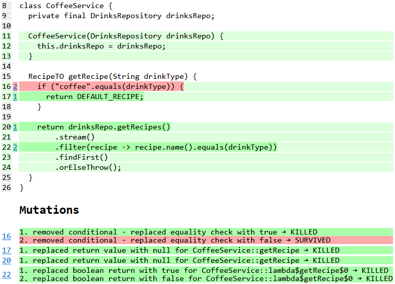
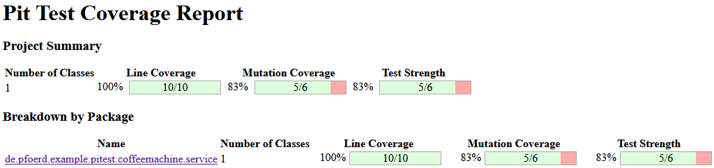
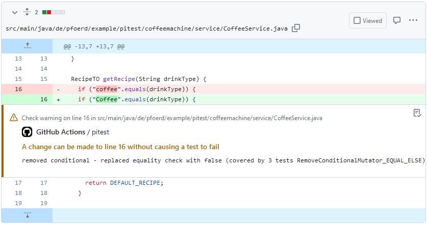
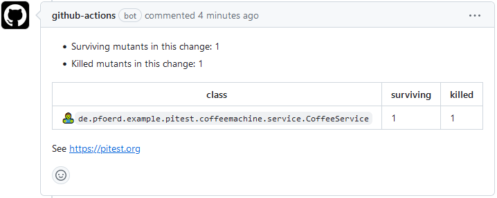

# Simple Pitest Gradle Sample

This project showcases mutation testing using [Pitest](https://pitest.org/) based on a simple Gradle/Java 
project.

## Showcase for Pitest mutation analysis

Running `./gradlew pitest` starts mutation analysis and creates the following report:

## Showcase for pull request integration

The project also showcases the Github pull request integration using Arcmutate's 
[Git](https://docs.arcmutate.com/docs/git-integration.html) and 
[Github Integration](https://docs.arcmutate.com/docs/github/github-integration.html) plugins.

You can find a sample pull request with annotations made by the Pitest PR workflow in the pull requests of the project 
in GitHub.

## Build the project

### Prerequisites

* Java 17

### Run mutation analysis

* Clone the repository
* Temporary remove the line `features.add("+GIT(from[HEAD~1])")` in _build.gradle.kts_
* Run `./gradlew pitest` in project root
* Open the report: _build/reports/pitest/index.html_